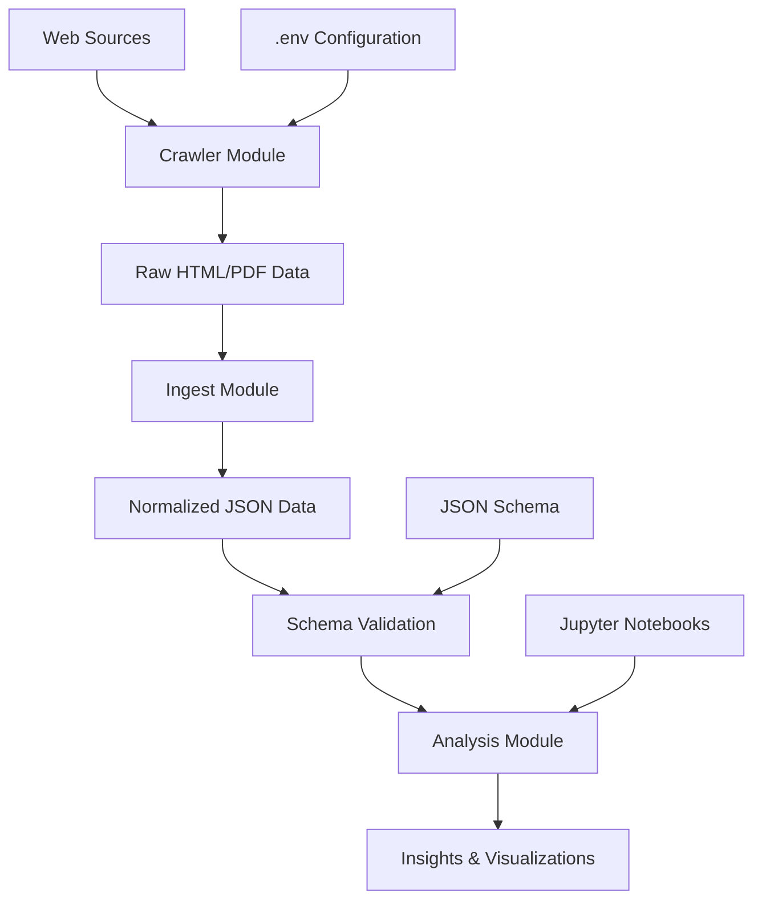

# Architecture Documentation

## System Overview

The Itabashi Minutes project is designed as a modular data pipeline for crawling, processing, and analyzing Japanese council meeting minutes. The architecture follows a clear separation of concerns with distinct stages for data acquisition, normalization, and analysis.



## Module Architecture

### 1. Crawler Module (`/crawler`)

**Purpose**: Web scraping and data extraction from Itabashi Ward website

**Components**:
- `itabashi_spider.py`: Main crawler implementation
- `.env.example`: Configuration template
- `sample/`: Output directory for sample data

**Key Classes**:
```python
class ItabashiMinutesCrawler:
    - __init__(base_url, request_delay)
    - get_latest_fiscal_year_minutes()
    - _extract_minute_data(url, title)
    - _make_request(url)  # Rate limiting & error handling
```

**Design Patterns**:
- **Singleton Pattern**: Single session management
- **Strategy Pattern**: Different extraction methods for HTML/PDF
- **Rate Limiting**: Respectful crawling with configurable delays

### 2. Ingest Module (`/ingest`)

**Purpose**: Text normalization and preprocessing for Japanese content

**Components**:
- `text_normalizer.py`: Japanese text processing pipeline

**Key Classes**:
```python
class JapaneseTextNormalizer:
    - normalize_unicode(text)          # NFKC normalization
    - normalize_numbers_and_alphabets(text)  # Full-width → Half-width
    - normalize_katakana(text)         # Half-width → Full-width katakana
    - extract_paragraphs(text)         # Text segmentation
    - process_minutes_record(record)   # End-to-end processing
```

**Processing Pipeline**:
1. Unicode normalization (NFKC)
2. Character width standardization
3. Quote mark normalization
4. Whitespace cleanup
5. Paragraph extraction

### 3. Schema Module (`/schemas`)

**Purpose**: Data structure validation and documentation

**Components**:
- `minutes.schema.json`: JSON Schema for normalized records

**Schema Structure**:
```json
{
  "meeting_date": "YYYY-MM-DD",
  "committee": "本会議|常任委員会|特別委員会|その他",
  "agenda_items": [
    {
      "agenda_item": "string",
      "speaker": "string", 
      "speech_text": "string",
      "page_no": "integer",
      "paragraphs": ["string"]
    }
  ],
  "metadata": { ... }
}
```

### 4. Analysis Module (`/analysis`)

**Purpose**: Data analysis and visualization notebooks

**Components**:
- `topic_modeling.ipynb`: LDA topic extraction
- `keyword_trends.ipynb`: Keyword frequency analysis
- `speaker_stats.ipynb`: Speaker activity statistics

**Analysis Capabilities**:
- **Topic Modeling**: Latent Dirichlet Allocation (LDA)
- **Keyword Analysis**: TF-IDF, frequency trends
- **Speaker Analytics**: Activity patterns, specialization
- **Time Series**: Temporal trends and seasonality

## Data Flow Architecture

### Stage 1: Data Acquisition
```
Web Sources → HTTP Requests → HTML/PDF → Raw Text Extraction
```

### Stage 2: Data Normalization
```
Raw Text → Unicode Normalization → Character Standardization → Structured JSON
```

### Stage 3: Data Validation
```
Structured JSON → Schema Validation → Error Handling → Clean Dataset
```

### Stage 4: Data Analysis
```
Clean Dataset → Feature Extraction → ML Analysis → Visualizations
```

## Security & Compliance

### Rate Limiting
- Configurable request delays (default: 1 second)
- Exponential backoff on errors
- Respect for robots.txt

### Data Privacy
- No personal information storage
- Public domain content only
- Attribution requirements

### Error Handling
```python
try:
    response = self._make_request(url)
    if not response:
        return []  # Graceful degradation
except RequestException as e:
    logger.error(f"Request failed: {e}")
    return []
```

## Scalability Considerations

### Horizontal Scaling
- Stateless crawler design
- Parallel processing capabilities
- Modular analysis notebooks

### Vertical Scaling
- Memory-efficient text processing
- Streaming JSON parsing for large datasets
- Incremental analysis updates

### Storage Optimization
- JSON compression for archives
- Efficient schema design
- Index-friendly data structures

## Technology Stack

### Core Dependencies
```toml
[tool.poetry.dependencies]
python = "^3.8"
requests = "^2.31.0"
beautifulsoup4 = "^4.12.0"
pandas = "^2.0.0"
scikit-learn = "^1.3.0"
mecab-python3 = "^1.0.6"
```

### Development Dependencies
```toml
[tool.poetry.group.dev.dependencies]
pytest = "^7.4.0"
flake8 = "^6.0.0"
mypy = "^1.5.0"
jupyter = "^1.0.0"
```

## Configuration Management

### Environment Variables
```bash
# Core settings
ITABASHI_BASE_URL=https://www.city.itabashi.tokyo.jp
REQUEST_DELAY=1.0
MAX_PAGES=100

# Processing settings
OUTPUT_DIR=./data
LOG_LEVEL=INFO
REQUEST_TIMEOUT=30
```

### Runtime Configuration
- Dynamic rate limiting adjustment
- Configurable output formats
- Flexible analysis parameters

## Monitoring & Logging

### Logging Strategy
```python
import logging

logging.basicConfig(
    level=logging.INFO,
    format='%(asctime)s - %(name)s - %(levelname)s - %(message)s',
    handlers=[
        logging.FileHandler('crawler.log'),
        logging.StreamHandler()
    ]
)
```

### Metrics Collection
- Request success/failure rates
- Processing time metrics
- Data quality indicators
- Analysis performance metrics

## Future Architecture Enhancements

### Planned Improvements
1. **Database Integration**: PostgreSQL for structured storage
2. **API Layer**: REST API for data access
3. **Real-time Processing**: Streaming data pipeline
4. **Machine Learning Pipeline**: Automated model training
5. **Web Interface**: Dashboard for analysis results

### Microservices Migration
```
Current: Monolithic Python Application
Future: 
  - Crawler Service (Python/FastAPI)
  - Processing Service (Python/Celery)  
  - Analysis Service (Python/MLflow)
  - API Gateway (Go/Gin)
  - Frontend (React/TypeScript)
```

## Deployment Architecture

### Local Development
```bash
# Single machine deployment
python crawler/itabashi_spider.py
python ingest/text_normalizer.py
jupyter notebook analysis/
```

### Production Deployment
```yaml
# Docker Compose example
version: '3.8'
services:
  crawler:
    build: ./crawler
    environment:
      - REQUEST_DELAY=2.0
  
  processor:
    build: ./ingest
    depends_on:
      - crawler
      
  analyzer:
    build: ./analysis
    depends_on:
      - processor
```

## Performance Considerations

### Bottleneck Analysis
1. **Network I/O**: Rate limiting prevents parallelization
2. **Text Processing**: MeCab initialization overhead
3. **Memory Usage**: Large datasets in pandas DataFrames
4. **Analysis Speed**: ML model training time

### Optimization Strategies
1. **Caching**: HTTP response caching, MeCab instance reuse
2. **Streaming**: Process data in chunks
3. **Parallel Processing**: Multi-core analysis where possible
4. **Profiling**: Regular performance monitoring

## Testing Strategy

### Unit Tests
```python
def test_text_normalization():
    normalizer = JapaneseTextNormalizer()
    input_text = "ＡＢＣＤ１２３４"
    expected = "ABCD1234"
    assert normalizer.normalize_numbers_and_alphabets(input_text) == expected
```

### Integration Tests
```python
def test_crawler_integration():
    crawler = ItabashiMinutesCrawler()
    results = crawler.get_latest_fiscal_year_minutes()
    assert len(results) > 0
    assert all('meeting_date' in r for r in results)
```

### End-to-End Tests
- Full pipeline execution
- Data quality validation
- Analysis result verification

This architecture provides a solid foundation for the Itabashi Minutes project while maintaining flexibility for future enhancements and scaling requirements.